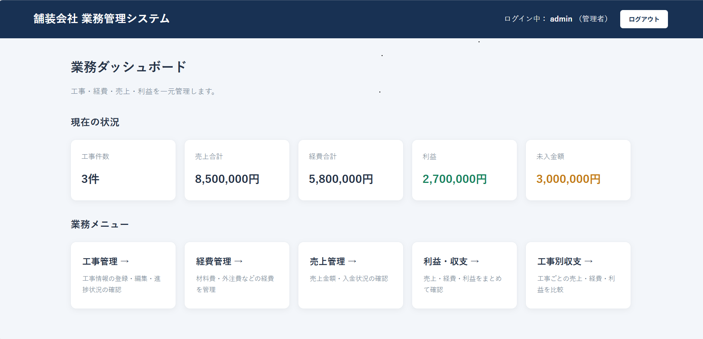
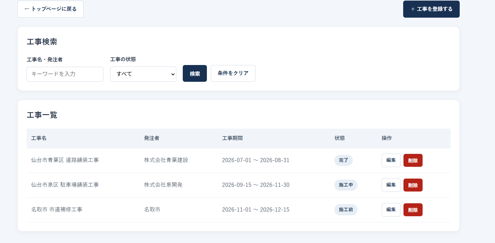
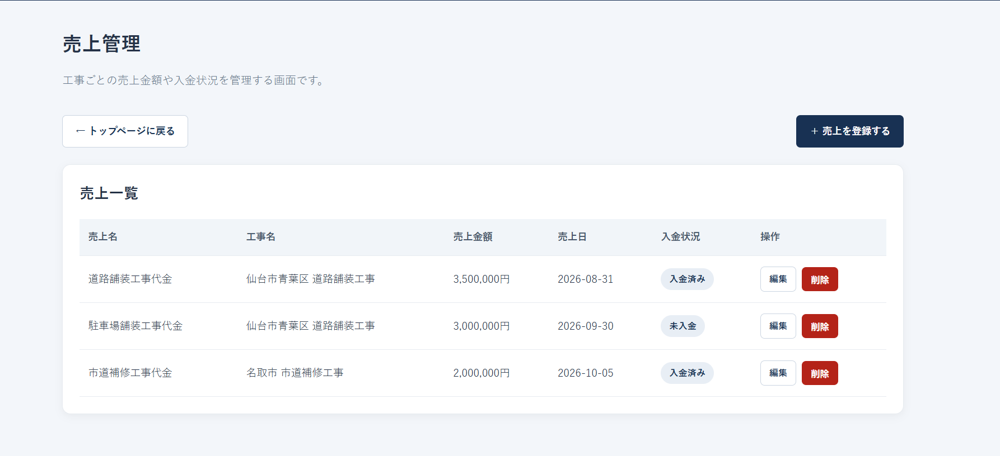
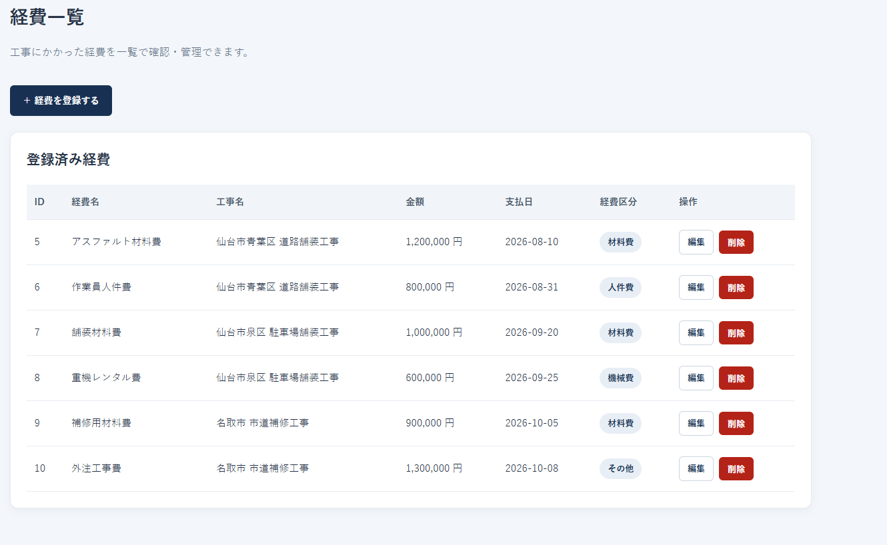
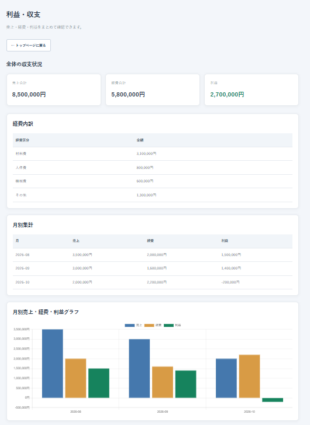
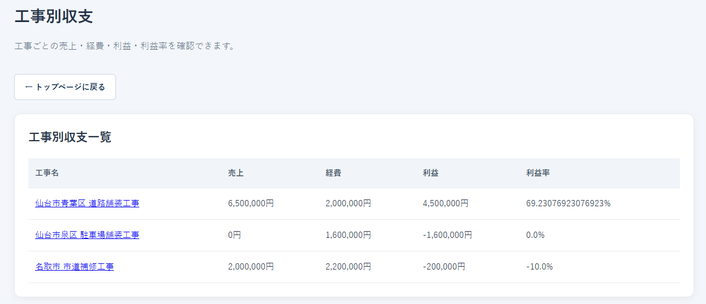

# 舗装会社 業務管理システム（Pavement Management System）

## アプリ画面



## 1. アプリケーション概要

舗装会社の工事情報・売上・経費・利益を一元管理するWebアプリケーションです。

工事ごとの進捗状況や収支を確認でき、売上・経費の登録内容から利益を自動計算します。

情報をまとめて管理することで、工事の進捗把握や収支管理を効率化することを目的としています。

## 2. 制作背景・目的

祖父が土木・舗装関係の仕事をしていたことをきっかけに、建設業における工事管理や収支管理に関心を持ちました。

舗装工事では、工事ごとに材料費や人件費などの経費が発生し、それぞれの売上と経費を把握することが重要だと考えました。

また、簿記の学習を通じて、売上や費用を正しく管理し、利益を把握することの重要性を学びました。

そこで、身近な業種への関心と簿記の学習経験を組み合わせ、工事情報と収支情報を関連付けて管理できるWebアプリケーションを制作しました。

単にデータを登録するだけでなく、工事ごとの利益を可視化し、経営状況を把握しやすくすることを目指しています。

## 3. 主な機能

### ダッシュボード

- 登録工事件数の表示
- 売上合計の表示
- 経費合計の表示
- 利益の自動計算
- 未入金額の表示

### 工事管理

- 工事情報の登録・一覧表示・編集・削除
- 工事名・発注者によるキーワード検索
- 工事の状態による絞り込み
- 工事期間・進捗状況の管理
- 売上や経費が紐づく工事の誤削除防止

### 売上管理

- 売上情報の登録・一覧表示・編集・削除
- 工事との関連付け
- 売上金額・売上日の管理
- 入金状況の管理

### 経費管理

- 経費情報の登録・一覧表示・編集・削除
- 工事との関連付け
- 経費区分の管理
- 支払日・金額の管理

### 利益・収支管理

- 売上合計・経費合計・利益の集計
- 工事別の利益確認
- 経費区分別の集計
- 月別収支の表示
- グラフによる収支の可視化

### ログイン・権限管理

- 管理者と一般ユーザーのログイン
- 管理者：データの閲覧・登録・編集・削除
- 一般ユーザー：データの閲覧
- 権限のない操作へのアクセス制限

## 4. 使用技術

| 分類 | 技術 |
|---|---|
| 開発言語 | Java 25 |
| フレームワーク | Spring Boot 4.1.1 |
| Web | Spring MVC |
| テンプレートエンジン | Thymeleaf |
| データベース | H2 Database |
| データアクセス | Spring Data JPA / Hibernate |
| セキュリティ | Spring Security |
| 入力チェック | Jakarta Validation |
| フロントエンド | HTML / CSS / JavaScript |
| グラフ表示 | Chart.js |
| ビルドツール | Maven |
| 開発環境 | Eclipse Pleiades |
| バージョン管理 | Git / GitHub |

## 5. システム構成

本システムでは、Spring MVCの構成を採用しています。

- **Controller**：画面遷移やリクエストの処理
- **Model / Entity**：工事・売上・経費などのデータの定義
- **Repository**：データベースへの登録・検索・更新・削除
- **View（Thymeleaf）**：画面の表示

Spring Data JPAを利用し、JavaのEntityとデータベースのテーブルを関連付けています。

## 6. データベース設計

主要なデータは以下の3つです。

| テーブル | 主な管理情報 |
|---|---|
| Project | 工事名、発注者、工事期間、状態 |
| Sales | 売上名、工事、売上金額、売上日、入金状況 |
| Expense | 経費名、工事、金額、支払日、経費区分 |

工事（Project）を中心として、売上（Sales）と経費（Expense）を関連付けています。

1つの工事に対して、複数の売上・経費を登録できる構成です。

※ ER図は別途追加予定です。

## 7. 工夫した点

### ① 工事単位での収支管理

売上と経費を工事情報に関連付けることで、工事ごとの利益を確認できるようにしました。

### ② 利益の自動計算

登録された売上と経費を集計し、利益を自動計算する仕組みを実装しました。

**利益 ＝ 売上合計 − 経費合計**

売上や経費を編集・削除した際にも、集計結果が反映されるようにしています。

### ③ データの整合性を考慮した削除処理

売上や経費が紐づいている工事を削除しようとした場合、削除を防止してエラーメッセージを表示する仕組みを実装しました。

関連データが残ったまま工事が削除されることを防ぎ、データの整合性を維持することを意識しました。

### ④ ユーザー権限の管理

Spring Securityを使用して、管理者と一般ユーザーで操作可能な機能を分けました。

画面上のボタン表示だけでなく、URLへ直接アクセスした場合も権限を確認する構成にしています。

### ⑤ 入力値の検証

Jakarta Validationを利用して、必須項目や金額などの入力チェックを実装しました。

## 8. 動作環境・起動方法

### 動作環境

- Java 25
- Maven
- Spring Boot 4.1.1
- H2 Database

### 起動手順

1. リポジトリをクローンします。
2. Java 25を使用できる環境を用意します。
3. 以下の環境変数を設定します。

| 環境変数 | 内容 |
|---|---|
| PAVEMENT_ADMIN_PASSWORD | 管理者用パスワード |
| PAVEMENT_USER_PASSWORD | 一般ユーザー用パスワード |

4. Mavenを使用してSpring Bootアプリケーションを起動します。

```bash
mvn spring-boot:run
```

5. ブラウザで以下にアクセスします。

```text
http://localhost:8080/
```

### 補足

- ログインユーザー名は管理者が `admin`、一般ユーザーが `user` です。
- パスワードは環境変数で管理しており、ソースコードには直接記載していません。
- H2データベースはローカルファイルに保存されます。
- データベースファイルはGitの管理対象から除外する設定にしています。

## 9. 画面イメージ

### 工事管理画面



### 売上管理画面



### 経費管理画面



### 利益・収支画面



### 工事別利益画面




## 10. 今後の改善予定

- 工事・売上・経費の検索機能の拡充
- CSV出力機能
- 月別・工事別の分析機能の充実
- 入力チェックや例外処理の改善
- ユーザー管理機能の拡張

## 11. 開発中の課題と解決方法

開発中に発生したエラーについて、原因の調査から解決までの過程を記録しています。

特に、Spring Securityの認証機能の実装では、環境変数の設定に関する起動エラーを経験し、原因を調査して解決しました。

詳しくは以下をご覧ください。

[開発中のエラーと解決記録](docs/troubleshooting.md)

## 12. 制作を通じて学んだこと

本アプリケーションの制作を通じて、Spring Bootを使用したWebアプリケーション開発の一連の流れを学びました。

特に、Controller・Entity・Repository・Viewの役割分担、データベースの関連付け、入力値の検証、Spring Securityによる権限制御について理解を深めました。

また、実装中に発生したデータベースの参照整合性エラーや画面表示エラーを調査・修正することで、エラーメッセージを読み取り、原因を特定して改善する経験を積むことができました。

今後も、実際の業務で利用することを想定し、使いやすさ・保守性・安全性を意識した開発を続けていきたいと考えています。