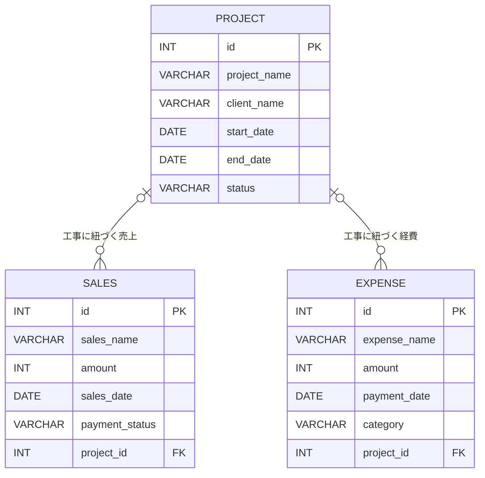

# ER図｜舗装会社 業務管理システム

本資料は `Project.java`、`Sales.java`、`Expense.java` の JPA Entity 定義に基づく論理ER図です。

## テーブル概要

| テーブル | 用途 | 主キー | 外部キー |
| --- | --- | --- | --- |
| `PROJECT` | 工事の基本情報を管理 | `id` | なし |
| `SALES` | 工事に紐づく売上を管理 | `id` | `project_id` → `PROJECT.id` |
| `EXPENSE` | 工事に紐づく経費を管理 | `id` | `project_id` → `PROJECT.id` |

## リレーション

- 工事1件に対して、売上は0件以上登録可能（1対多）。
- 工事1件に対して、経費は0件以上登録可能（1対多）。
- `Sales.project` と `Expense.project` は `@ManyToOne` で、`optional=false` は指定されていないため、Entity定義上は工事未設定も許容されます。
- 売上と経費の間に直接のリレーションはありません。

## 補足

- カラム名はSpring Boot / Hibernateの標準的な命名規則（camelCase → snake_case）を前提に記載しています。実際のDBスキーマはH2上で確認してください。
- 金額は `int` 型、日付は `LocalDate` 型です。
- `@NotBlank`、`@NotNull`、`@Min` は入力値の検証に使用しています。これらだけでDBの全制約が確定するわけではありません。
