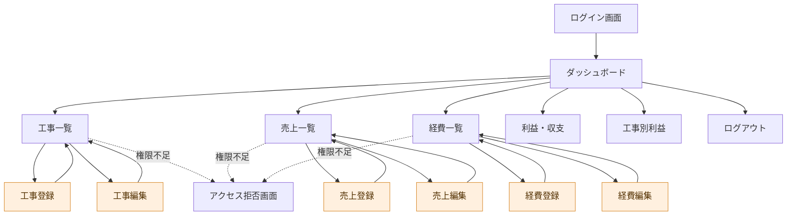

# 画面遷移図

## 舗装会社 業務管理システム（PavementManagement）

以下は主要な画面の遷移をまとめた図です。管理者（ADMIN）は登録・編集・削除操作ができ、一般ユーザー（USER）は閲覧を中心に利用します。

## 主な画面と操作

| 画面 | 主な操作 | 利用権限 |
| --- | --- | --- |
| ログイン | ユーザー認証 | 未ログイン |
| ダッシュボード | 工事件数・売上・経費・利益・未入金額の確認 | ADMIN / USER |
| 工事一覧 | 工事情報の閲覧 | ADMIN / USER |
| 工事登録・編集 | 工事情報の登録・更新 | ADMIN |
| 売上一覧 | 売上情報の閲覧 | ADMIN / USER |
| 売上登録・編集 | 売上情報の登録・更新 | ADMIN |
| 経費一覧 | 経費情報の閲覧 | ADMIN / USER |
| 経費登録・編集 | 経費情報の登録・更新 | ADMIN |
| 利益・収支 | 売上・経費・利益の確認 | ADMIN / USER |
| 工事別利益 | 工事ごとの収支の確認 | ADMIN / USER |
| アクセス拒否 | 権限不足時の案内 | 認証済みユーザー |

> 注：主要画面の構成を示した概略図です。削除は一覧画面からの操作として扱い、独立した画面としては描いていません。実際のURLや細かな遷移条件は各Controllerの実装に従います。
